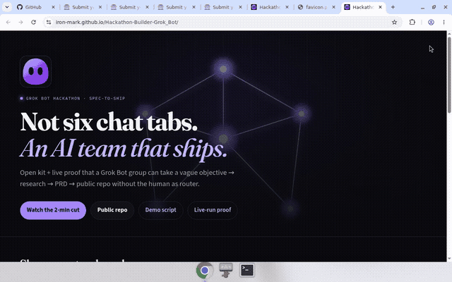
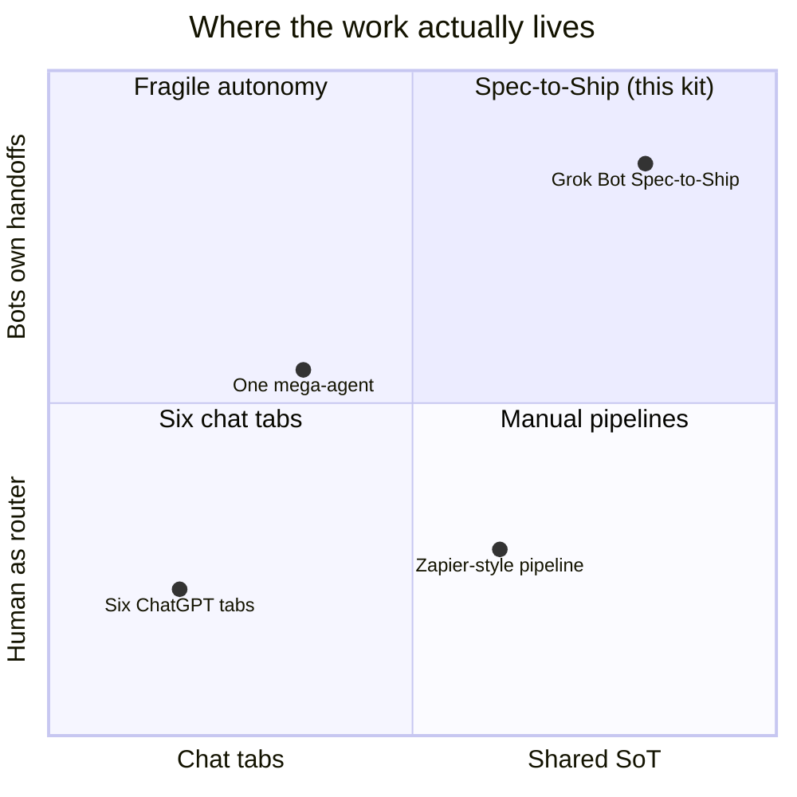
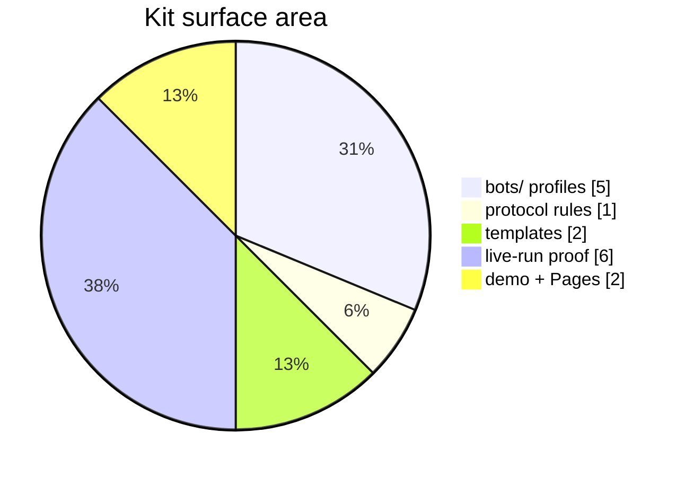
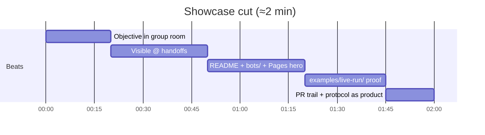
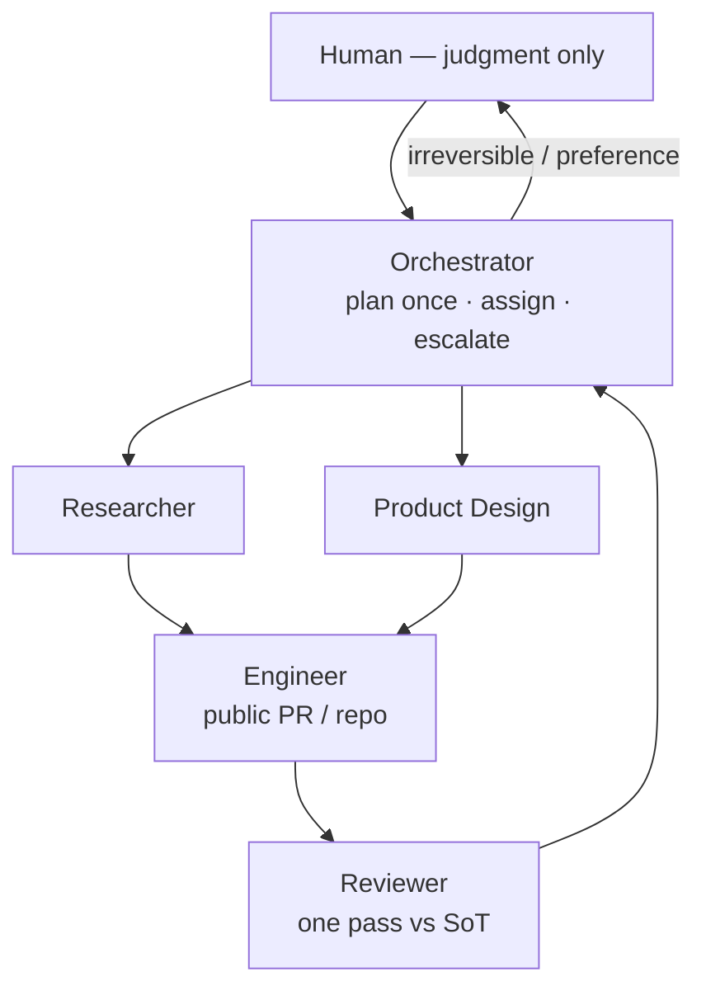
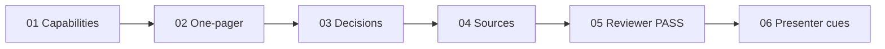

# Hackathon-Builder-Grok_Bot

  

  

  <strong>Not six chat tabs.</strong> An AI team that ships. 
  <a href="https://iron-mark.github.io/Hackathon-Builder-Grok_Bot/">Live Pages</a> ·
  <a href="demo/SCRIPT.md">2-min demo</a> ·
  <a href="examples/live-run/">Live-run proof</a> ·
  <a href="LICENSE">MIT</a>

---

Open kit + live proof that a **Grok Bot group** can take a vague objective → research → PRD → shipped PR **without the human as router**.

Handoffs are visible in the group room. Notion/GitHub are the source of truth. The PR trail *is* the demo.

  

## Submitted & pitched

> **Status:** Submitted to the Grok Bot Hackathon form (Notion confirmed receipt) and pitched live at **Grok Bot Manila Meetup** — Friday, September 4, 2026 — RealPage, X Philippines.
>
> Entry: Mark Szn · Demo: [Live Pages](https://iron-mark.github.io/Hackathon-Builder-Grok_Bot/) · Repo: [Iron-Mark/Hackathon-Builder-Grok_Bot](https://github.com/Iron-Mark/Hackathon-Builder-Grok_Bot) · License: MIT

  

<em>GIF preview — <a href="https://iron-mark.github.io/Hackathon-Builder-Grok_Bot/#demo">3:32 public-project walkthrough on Pages</a> · <a href="docs/assets/video/showcase-2min.mp4">mp4</a> (Pages + GitHub artifacts; no live Grok-room footage)</em>

## Why this exists

Most “multi-agent” demos are six ChatGPT tabs with a human as the router. This kit shows the opposite:

| One chatbot / one agent | This kit |
|-------------------------|----------|
| You paste context between tabs | Bots `@` each other with owner + DoD |
| Memory is the source of truth | Notion / GitHub / Drive are SoT |
| Endless debate | One Reviewer pass, then escalate |
| Slide deck for the demo | Live room + Pages + PR trail |

Built for the **Grok Bot Hackathon** (X Philippines): one real task, public/non-sensitive data, public GitHub, ≥1 Grok Bot.

## What's in the box

| Path | Deliverable |
|------|-------------|
| [`bots/`](bots/) | Paste-ready profiles — Orchestrator, Researcher, Product Design, Engineer, Reviewer |
| [`protocol/operating-rules.md`](protocol/operating-rules.md) | Ownership, handoff, anti-loop, escalation, completion |
| [`templates/`](templates/) | Notion + GitHub templates (research DB, PRD, decision log, PR checklist) |
| [`examples/live-run/`](examples/live-run/) | Artifacts from *this* crew’s first Spec-to-Ship |
| [`demo/SCRIPT.md`](demo/SCRIPT.md) | 2-minute Showcase cut |
| [`docs/`](docs/) | GitHub Pages landing + [`docs/assets/`](docs/assets/) (hero, OG, video slot, [`pitch/`](docs/assets/pitch/)) |

## Quick start

1. Create **five** Grok Bots; paste each file from [`bots/`](bots/) into the Bot description.
2. Create a **group chat** with those five Bots.
3. Paste the kickoff from [`demo/SCRIPT.md`](demo/SCRIPT.md).
4. Watch: plan once → `@` lanes → research/PRD → public PR → one Reviewer pass → one human judgment.

## Demo (2 min)

Present from **[Pages](https://iron-mark.github.io/Hackathon-Builder-Grok_Bot/) + the group room** — not a slide deck.

| Time | Beat |
|------|------|
| **0:00** | Mark: one objective in the group |
| **0:20** | Visible `@` handoffs (owner / deliverable / SoT / DoD) |
| **0:50** | Cut to README + `bots/` |
| **1:20** | `examples/live-run/` proof |
| **1:45** | PR trail + `protocol/` — not six chat tabs |

Full script: [`demo/SCRIPT.md`](demo/SCRIPT.md) · Presenter cues: [`examples/live-run/06-presenter-cues.md`](examples/live-run/06-presenter-cues.md)

**Video:** `docs/assets/video/showcase-2min.mp4` (shot list in [`docs/assets/ASSETS.md`](docs/assets/ASSETS.md)).

## How the crew works

Rules that keep the room useful: **one owner, one deliverable, one SoT, one DoD** per task. Room posts = assignment / handoff / blocker / verdict only. Full protocol: [`protocol/operating-rules.md`](protocol/operating-rules.md).

## Live-run proof

This repo *is* the first Spec-to-Ship:

1. [Capabilities](examples/live-run/01-capabilities.md) — confirmed Grok Bot facts
2. [Product one-pager](examples/live-run/02-product-one-pager.md)
3. [Decision log](examples/live-run/03-decision-log.md)
4. [Sources](examples/live-run/04-sources.md)
5. [Reviewer pass](examples/live-run/05-reviewer-pass.md)
6. [Presenter cues](examples/live-run/06-presenter-cues.md)

## Assets

| File | Use |
|------|-----|
| [`docs/assets/hero-handoff.svg`](docs/assets/hero-handoff.svg) | Pages hero + README banner |
| [`docs/assets/og-card.svg`](docs/assets/og-card.svg) | Social / OG preview |
| [`docs/assets/video/`](docs/assets/video/) | Showcase recording slot |
| [`docs/assets/pitch/`](docs/assets/pitch/) | 12s GIF preview of the showcase storyboard |
| [`docs/assets/ASSETS.md`](docs/assets/ASSETS.md) | Shot list + asset map |

## License

MIT — see [LICENSE](LICENSE).
